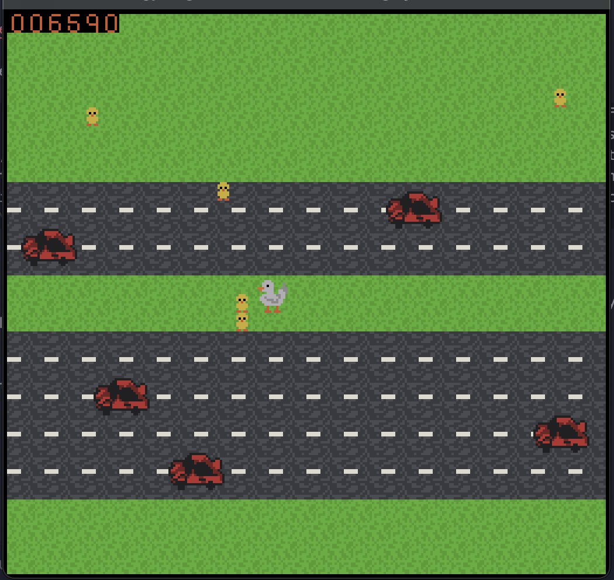

# MOTHER GOOSE

Author: Bernardo Miranda

This is a crossy road type game where you are a mother goose and are trying to rescue your gooselings from the streets as you cross it. It's interesting since the ducklings add a score multiplier to your score but also makes your trail longer, so a car can run over your ducklings at any time, erasing your multiplier streak.
Screen Shot:

How Your Asset Pipeline Works:

The source files I drew is assets.blob, I drew them using my asset_pipeline.cpp function. First, the spritesheet I made only has 3 colors, each corresponding to one index of the palettes that they correspond to (transparent represents index 0, red represents index 1, green represents index 2, and blue represents index 3). This way, I dont have to code a complicated color finder or color assignment system for my sprite sheet, it can just simply be some manual labor (setting all the colors to RGB) and in turn, the logic is much simpler. As for the actual asset pipeline itself, I turn my entire 128x128 spritesheet into tiles and then I access them within the game logic when they're in assets.blob by using the asset_pipeline exe that it builds. Playmode's constructor reads these from assets.blob and puts them straight into the ppu tile table and ppu palette table. It goes assets.png -> assets.blob -> tile table.

I have some extra tiles in the assets.png file that I wasnt able to use due to time constraints, but I planned on randomizing more things like the color of the car (I have 3 palettes for cars) and randomizing the size of the cars (I have two setups for the size of the cars).

How To Play:

Use the arrow keys to move around. Your goal is to reach the end of the road and maximize your score.
By picking up chicks, you can make your score much, much higher!
But if your chicks get run over and die, your score multiplier goes back to 1x.

This game was built with [NEST](NEST.md).
